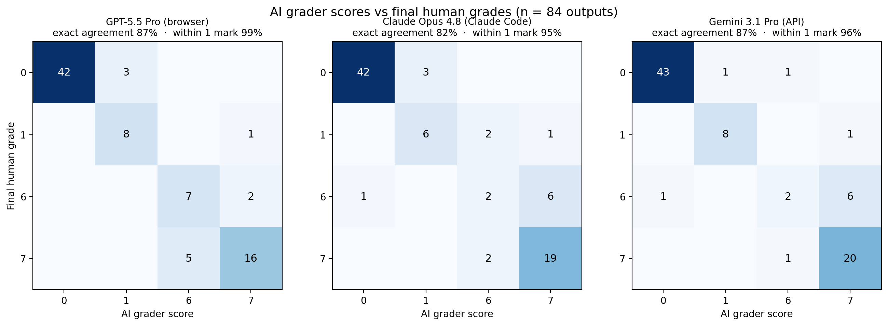

# AIMO Proof Pilot — Problems, Submissions and Grading Data

This repository contains the full public artefacts of the **AIMO Proof Pilot**: the six problems and their markschemes, all 84 graded submissions (from 6 Kaggle teams and 8 reference models), the final grades with per-submission grading reports, and the supporting data behind the AI-grader comparison study.

The Proof Pilot asked teams to do something genuinely hard: produce full, IMO-style mathematical **proofs** (rather than just final numeric answers) using only models that are truly open source — models for which intermediate checkpoints, training protocols and training data are publicly available. Alongside the team submissions, we evaluated 8 other models on the same problems, covering both open-weight models run locally and state-of-the-art commercial systems, all graded through exactly the same process.

## The problems

The six problems were drawn from the AIMO3 public leaderboard set. They range from National Olympiad hard to IMO medium in difficulty, so they sit a little below a full IMO set. They also do not give complete coverage of all topics and difficulties: we tested a particular set of topic and difficulty combinations rather than the whole space. Each problem also has a numeric final answer, allowing automated answer-checking alongside the proof grading.

As the results show, certain topics seem to be found harder, even by SoTA models. We judged P4 (COLOUR) to be an IMO easy combinatorics problem, yet only one of the commercial SoTA models we tested was able to solve it.

| # | ID | Topic |
|---|---|---|
| 1 | DIVALL | Number theory |
| 2 | ALTORO | Geometry |
| 3 | SINDEX | Algebra |
| 4 | COLOUR | Combinatorics |
| 5 | POLYGO | Algebra |
| 6 | AMAZIN | Geometry |

Problem statements are in [`problems_and_markschemes/problems.pdf`](problems_and_markschemes/) (and as LaTeX source in `problems.csv`); the reference solutions and detailed markschemes are in `markschemes.pdf`.

## Submissions and anonymisation

Each problem received 14 submissions: 6 from Kaggle teams (`team_1` … `team_6`) and 8 from reference models (`model_1` … `model_8`) — 84 submissions in total. All submissions were **anonymised before grading** to eliminate any possibility of bias: graders saw only `team_N` / `model_N` labels and graded each submission purely on its content.

[`mapping.csv`](mapping.csv) reveals which team and model is which, with columns:

- `type` — `team` or `model`
- `number` — the anonymised index used throughout this repository
- `name` — the team name, or the model identifier
- `how_run` — models only: `vllm` (open-weight model run locally via vLLM), `browser` (commercial system used through its web interface), or `claude_code` (run via the Claude Code CLI)

## The grading process

Grading full proofs requires human judgement, and we took this seriously.

**Markschemes fixed before the evaluation.** The reference solutions and markschemes were drafted in full *before* the evaluation was conducted — in particular, before any outputs were generated. To make this verifiable rather than merely asserted, a SHA-256 hash of the finalised markscheme document was shared on Kaggle in advance, and the complete document was disclosed to Kaggle ahead of the evaluation. Any later change to the solutions or markschemes would have changed the hash, so anyone can confirm that the grading criteria were settled before the submissions existed and were not altered in light of them.

**Scoring scale.** Each submission was marked on a simplified IMO-style scale restricted to **0, 1, 6 or 7** (maximum total 42 across the six problems). This reduces grading to two binary decisions, making scoring faster, more consistent between graders, and easier to reconcile:

1. **Is the solution essentially complete?**
   - If **no**: award **1** for significant partial progress, otherwise **0**.
   - If **yes**: award **7**, or **6** if there is a minor error or omission.

The bar for "essentially complete" is generally *stricter* than the corresponding IMO bar, and with no 2–5 band, partial credit is harsher than at the IMO. Unless a problem's markscheme says otherwise, an essentially-complete solution with one or more minor (easily corrected, non-structural) errors scores 6 — but an accumulation of small omissions can amount to a material hole, dropping the solution to the partial-progress band.

**Grading against the markscheme.** Each markscheme is structured around the key mathematical milestones of the problem, not a single fixed write-up. Submissions taking a genuinely different but valid route were mapped onto the same milestones, so an alternative approach that reaches an equivalent decisive step earns equivalent credit.

**Multiple graders and consensus.** Every submission was graded **independently** by at least **two expert human graders**, working from the same template ([`grading_templates/grading_template.tex`](grading_templates/)) without seeing each other's marks. Where graders diverged, additional graders were brought in — for some submissions as many as **four** graders assessed the work — and disagreements were resolved by discussion to a **consensus final grade**, recorded in a final grading report (one per submission, in [`grades/`](grades/)).

**AI graders.** In parallel, three frontier models graded every submission through the same anonymised process, allowing us to study how well AI graders track expert human judgement. They played no part in determining the final grades. In the data files they are labelled:

- **CG** — GPT-5.5 Pro, in the browser
- **CL** — Claude Opus 4.8, via Claude Code in the terminal
- **GE** — Gemini 3.1 Pro (Preview), via API

## Final results

**Teams** (marks per problem, out of 7):

| Rank | Team | P1 | P2 | P3 | P4 | P5 | P6 | **Total** |
|---|---|---|---|---|---|---|---|---|
| **1** | **Yi-Chia Chen** (team 4) | 7 | 7 | 7 | 0 | 7 | 1 | **29** |
| 2 | Nguyen (team 5) | 7 | 6 | 1 | 0 | 7 | 0 | **21** |
| 3 | Bogo de Chãn (team 3) | 6 | 7 | 0 | 0 | 7 | 0 | **20** |
| 4= | Andreas Bisiadis (team 1) | 0 | 0 | 0 | 0 | 0 | 0 | **0** |
| 4= | Just a test (team 2) | 0 | 0 | 0 | 0 | 0 | 0 | **0** |
| 4= | Natapong Nitarach (Schwyter) (team 6) | 0 | 0 | 0 | 0 | 0 | 0 | **0** |

**Models**:

| # | Model | Access | P1 | P2 | P3 | P4 | P5 | P6 | **Total** |
|---|---|---|---|---|---|---|---|---|---|
| 1 | Qwen3.6 35B-A3B | Local | 1 | 1 | 0 | 0 | 0 | 0 | **2** |
| 2 | DeepSeek V4 Flash | Local | 7 | 7 | 6 | 1 | 6 | 0 | **27** |
| 3 | OLMo 3 32B Think | Local | 1 | 0 | 0 | 0 | 0 | 0 | **1** |
| 4 | gpt-oss-120b | Local | 1 | 0 | 0 | 0 | 0 | 0 | **1** |
| 5 | GPT-5.5 Pro (extended reasoning) | Browser | 7 | 6 | 7 | 7 | 7 | 7 | **41** |
| 6 | Claude Opus 4.8 (high effort) | Browser | 7 | 1 | 6 | 0 | 7 | 0 | **21** |
| 7 | Claude Opus 4.8 (high effort) | Claude Code (terminal) | 7 | 7 | 6 | 0 | 7 | 6 | **33** |
| 8 | Gemini 3.1 Pro | Browser | 1 | 6 | 0 | 0 | 7 | 0 | **14** |

For context: the strongest of the three baseline models available to teams (OLMo) scored just 1 out of 42, so the top teams' scores represent a massive improvement on that starting point. The winning score of 29/42 exceeds every open-source and open-weight model we evaluated, and several state-of-the-art commercial systems.

## AI grader agreement

The figure below compares each AI grader's marks against the final human grades across all 84 submissions:



- All three AI graders track the final human grades closely: exact agreement ranges from 82% (Claude Code) to 87% (GPT-5.5 Pro and Gemini), and agreement within one mark ranges from 95% to 99%.
- Disagreements are overwhelmingly at adjacent marks (the 0/1 and 6/7 boundaries), where even human graders must make judgement calls.
- Serious disagreements — an AI grader placing an essentially failed proof (0/1) in the essentially correct band (6/7) or vice versa — were rare: once in 84 submissions for GPT-5.5 Pro, three times for Gemini, four for Claude Code.
- Where the AI graders erred, they tended towards leniency: Claude Code and Gemini both over-scored more often than they under-scored. GPT-5.5 Pro was the most balanced, and the only grader that never awarded major credit to a proof humans judged to have made no meaningful progress.

## Repository contents

```
.
├── README.md                       ← you are here
├── mapping.csv                     ← which team/model is which (see above)
├── problems_and_markschemes/
│   ├── problems.csv                ← problem statements (LaTeX source, one row per problem)
│   ├── problems.pdf                ← problem statements, compiled
│   └── markschemes.pdf             ← reference solutions + detailed markschemes
├── evals/                          ← the 84 submissions as graded
│   └── <#_ID>/                     ← e.g. 1_DIVALL … 6_AMAZIN
│       ├── team_1.txt … team_6.txt     ← raw submission text (ground truth)
│       ├── model_1.txt … model_8.txt
│       └── *.pdf                   ← compiled renderings of the same submissions
├── eval_prompts/                   ← the per-submission AI-grading prompts (see its README)
├── grades/                         ← final grades
│   ├── grades_summary.csv
│   ├── final_answers.csv
│   ├── grades_additional_data.csv
│   └── <team_N|model_N>/<#_ID>_<team_N|model_N>.pdf   ← per-submission final grading report
├── grading_templates/
│   ├── grading_template.tex/.pdf   ← the sheet each human grader filled in independently
│   └── grading_final_template.tex  ← the template behind the final grading reports
└── figures/
    └── ai_grader_agreement.png     ← AI grader vs final human grade comparison
```

Notes on specific files:

- **`evals/`** — the `.txt` files are the submissions exactly as graded and should be taken as ground truth; the `.pdf` files are LaTeX-compiled renderings for easier reading and should closely match them.
- **`grades/<team_N|model_N>/*.pdf`** — one final grading report per submission (84 in total), recording the problem, submission, final consensus mark, and the reasoning behind it.
- **`grades/grades_summary.csv`** — final mark per submission per problem. Columns: `type`, `number`, `name`, then one column per problem (`1_DIVALL` … `6_AMAZIN`).
- **`grades/final_answers.csv`** — the numeric final answer extracted from each submission by an LLM parser (blank where no final answer could be extracted). Columns: `problem`, `team` (the anonymised id, e.g. `team_4` or `model_2`), `final_answer`.
- **`grades/grades_additional_data.csv`** — one row per submission per problem, combining everything: `problem`, `team` (anonymised id), `name`, `final_score` (final human consensus mark), `final_answer`, `final_answer_correct`, and the three AI graders' marks (`CG`, `CL`, `GE`).

## More

For the results discussion and teams' own write-ups, see the AIMO Proof Pilot pages on [Kaggle](https://www.kaggle.com/competitions/ai-mathematical-olympiad-proof-pilot).
